# CampaignX — v3 AWS Architecture

> Architecture as of March 2026. Streamlined for the Creative Automation Pipeline — analytics served directly from DynamoDB.

```mermaid
flowchart TB
    %% ════════════════════════════════════════════════════
    %% PRESENTATION TIER
    %% ════════════════════════════════════════════════════
    subgraph CLIENT ["🖥️  Client"]
        direction LR
        FE["<b>React Frontend</b><br/>Vite · React Spectrum S2<br/>TypeScript · Dark Mode<br/><i>Home · BriefForm · Canvas<br/>LoadingPipeline · Insights</i>"]
    end

    %% ════════════════════════════════════════════════════
    %% API TIER
    %% ════════════════════════════════════════════════════
    subgraph APIGW ["🔐  API Gateway — REST v1"]
        direction LR
        R1["POST /brief"]
        R2["POST /briefs/batch"]
        R3["GET /campaigns"]
        R4["GET /campaigns/{id}"]
        R5["PATCH /campaigns/{id}/approval"]
        R6["GET /insights"]
    end

    %% ════════════════════════════════════════════════════
    %% COMPUTE TIER — API LAMBDAS
    %% ════════════════════════════════════════════════════
    subgraph COMPUTE ["⚡  Lambda Functions"]
        direction TB
        L1["<b>SubmitBrief</b><br/>Python 3.12 · x86<br/>10s / 256 MB"]
        L4["<b>GetCampaigns</b><br/>Python 3.12 · x86<br/>10s / 256 MB"]
        L5["<b>GetInsights</b><br/>Python 3.12 · x86<br/>30s / 256 MB"]
        L6["<b>UpdateApproval</b><br/>Python 3.12 · x86<br/>10s / 256 MB"]
    end

    %% ════════════════════════════════════════════════════
    %% ASYNC PIPELINE
    %% ════════════════════════════════════════════════════
    subgraph ASYNC ["🔄  Async Generation Pipeline"]
        direction TB
        SQS["<b>SQS Queue</b><br/>campaignx-gen<br/>+ Dead Letter Queue<br/>Visibility: 360s · Retry: 3×"]
        L2["<b>GenerateCampaign</b><br/>Python 3.12 · <b>ARM64</b><br/>300s / 1024 MB<br/>maxConcurrency: 10"]
    end

    %% ════════════════════════════════════════════════════
    %% AI / BEDROCK TIER
    %% ════════════════════════════════════════════════════
    subgraph AI ["🧠  Amazon Bedrock"]
        direction TB
        AGENT["<b>Bedrock Agent</b><br/>Claude 3 Haiku<br/><i>Campaign Orchestrator</i>"]
        GUARD["<b>Guardrails</b><br/>Content Filter · Word Block<br/>Topic Denial"]
        AG1["<b>CreativeStrategy</b><br/>Action Group → Lambda"]
        AG2["<b>ComplianceCheck</b><br/>Action Group → Lambda"]
        L3["<b>CheckCompliance</b><br/>Python 3.12 · x86<br/>30s / 256 MB"]
        KB["<b>Knowledge Base</b><br/>Titan Embed v2 · 1024-dim<br/>S3 Data Source"]
        NOVA["<b>Nova Canvas</b><br/>Image Generation<br/>amazon.nova-canvas-v1:0"]
    end

    %% ════════════════════════════════════════════════════
    %% VECTOR DATABASE
    %% ════════════════════════════════════════════════════
    subgraph VECTOR ["🔍  Vector Database"]
        direction TB
        OSS["<b>OpenSearch Serverless</b><br/>Collection: VECTORSEARCH<br/>Index: knn_vector · HNSW<br/>Engine: faiss · l2 · 1024-dim"]
    end

    %% ════════════════════════════════════════════════════
    %% STORAGE TIER
    %% ════════════════════════════════════════════════════
    subgraph STORAGE ["📦  S3 Storage"]
        direction LR
        S3RAG["<b>rag-docs</b><br/>/brand-guidelines/<br/>/regional-trends/<br/><i>Auto-bootstrapped</i>"]
        S3IN["<b>assets-input</b><br/>/products/{name}/<br/>hero.png<br/><i>Brand reference images</i>"]
        S3OUT["<b>outputs</b><br/>/outputs/{id}/{product}/<br/>1x1 · 9x16 · 16x9<br/><i>CORS enabled</i>"]
    end

    %% ════════════════════════════════════════════════════
    %% DATABASE
    %% ════════════════════════════════════════════════════
    subgraph DB ["🗄️  Database"]
        DDB["<b>DynamoDB</b><br/>CampaignTable<br/>PK: campaign_id · SK: product_name<br/>GSI: status-created-index<br/>PAY_PER_REQUEST"]
    end

    %% ════════════════════════════════════════════════════
    %% CONNECTIONS
    %% ════════════════════════════════════════════════════

    %% Client → API
    FE -- "HTTPS + x-api-key" --> APIGW

    %% Routes → Lambdas
    R1 --> L1
    R2 --> L1
    R3 --> L4
    R4 --> L4
    R5 --> L6
    R6 --> L5

    %% Submit flow
    L1 -- "PutItem<br/>status: pending" --> DDB
    L1 -- "SendMessage" --> SQS

    %% Async generation
    SQS -- "EventSourceMapping<br/>maxConcurrency: 10" --> L2
    L2 -- "ConditionalWrite<br/>status: generating" --> DDB
    L2 -- "Check existing<br/>brand images" --> S3IN
    L2 -- "InvokeAgent" --> AGENT
    AGENT --> GUARD
    AGENT -- "RAG Retrieval" --> KB
    KB -- "Vector Search" --> OSS
    KB -- "Read Chunks" --> S3RAG
    AGENT --> AG1
    AGENT --> AG2
    AG1 --> L3
    AG2 --> L3
    L2 -- "GenerateImage" --> NOVA
    L2 -- "PutObject<br/>3 ratios × N products" --> S3OUT
    L2 -- "UpdateItem<br/>status: complete<br/>approval: pending_review" --> DDB

    %% Read flow
    L4 -- "Query / Scan" --> DDB
    L4 -- "GeneratePresignedUrl<br/>7-day expiry" --> S3OUT

    %% Approval
    L6 -- "UpdateItem<br/>approval_status" --> DDB

    %% Insights
    L5 -- "Scan + Aggregation" --> DDB

    %% ════════════════════════════════════════════════════
    %% STYLES
    %% ════════════════════════════════════════════════════
    classDef client fill:#1e293b,stroke:#3b82f6,color:#e2e8f0,stroke-width:2px
    classDef apigw fill:#0f172a,stroke:#f59e0b,color:#fef3c7,stroke-width:2px
    classDef lambda fill:#f59e0b,stroke:#d97706,color:#000,stroke-width:1px
    classDef sqs fill:#10b981,stroke:#059669,color:#fff,stroke-width:1px
    classDef bedrock fill:#7c3aed,stroke:#6d28d9,color:#fff,stroke-width:1px
    classDef vector fill:#ec4899,stroke:#db2777,color:#fff,stroke-width:1px
    classDef storage fill:#3b82f6,stroke:#2563eb,color:#fff,stroke-width:1px
    classDef db fill:#f97316,stroke:#ea580c,color:#fff,stroke-width:1px
    classDef route fill:#334155,stroke:#64748b,color:#e2e8f0,stroke-width:1px

    class FE client
    class R1,R2,R3,R4,R5,R6 route
    class L1,L2,L3,L4,L5,L6 lambda
    class SQS sqs
    class AGENT,GUARD,AG1,AG2,KB,NOVA bedrock
    class OSS vector
    class S3RAG,S3IN,S3OUT storage
    class DDB db
```

---

## Architecture Summary

### Deployed Components

| Layer | Service | Key Config |
|:------|:--------|:-----------|
| **Frontend** | React + Vite + Spectrum S2 | TypeScript, Dark Mode, Template Prompt Builder |
| **API** | API Gateway REST v1 | 6 routes, API key auth, full CORS |
| **Compute** | 6 Lambda Functions | Python 3.12, ARM64 for GenerateCampaign |
| **Queue** | SQS Standard + DLQ | maxConcurrency: 10, 3× retry |
| **AI Agent** | Bedrock Agent (Claude 3 Haiku) | 2 action groups, KB association, agent alias |
| **Guardrails** | Bedrock Guardrails | Content filter, word block, topic denial |
| **Vector DB** | OpenSearch Serverless | VECTORSEARCH, 1024-dim, HNSW/faiss/l2 |
| **Knowledge Base** | Bedrock KB + Titan Embed v2 | S3 data source, auto-synced on `terraform apply` |
| **Image Gen** | Amazon Nova Canvas | `amazon.nova-canvas-v1:0` |
| **Database** | DynamoDB (PAY_PER_REQUEST) | Composite key, GSI for approval queries |
| **Storage** | 3 × S3 Buckets | Versioning, SSE-AES256, CORS on outputs |
| **Presigned URLs** | S3 Presigned (7-day expiry) | Generated by GetCampaigns Lambda on every request |

### API Route Map

| Route | Lambda | Action |
|:------|:-------|:-------|
| `POST /brief` | SubmitBrief | Validate → DynamoDB (pending) → SQS |
| `POST /briefs/batch` | SubmitBrief | Batch validate → DynamoDB → SQS (max 50) |
| `GET /campaigns` | GetCampaigns | Scan DynamoDB, return campaign list |
| `GET /campaigns/{id}` | GetCampaigns | Query by PK, generate presigned URLs |
| `PATCH /campaigns/{id}/approval` | UpdateApproval | Write approval status to DynamoDB |
| `GET /insights` | GetInsights | Aggregate metrics from DynamoDB |

### Key Features
- **S3 Presigned URLs:** Generated with 7-day expiry by `GetCampaigns` Lambda for all image ratios.
- **OpenSearch Vector DB:** VECTORSEARCH collection with 1024-dim knn_vector index using HNSW/faiss/l2.
- **S3 CORS:** Enabled on Outputs bucket for cross-origin Blob fetching (localhost + HTTPS origins).
- **Automated Bootstrap:** RAG documents and product images auto-uploaded via `aws_s3_object` resources.
- **KB Auto-Sync:** Ingestion job triggered automatically on every `terraform apply` via `terraform_data` provisioner.
- **Template Prompt Builder:** Home page "Generate Ideas" dialog with `react-type-animation` for frictionless campaign creation.

### Future Enhancements (v4+)
- **Analytics Pipeline:** Kinesis Firehose → S3 Parquet → Glue → Athena for advanced SQL analytics at scale.
- **SNS Notifications:** Email alerts on approval state changes and DLQ failures.
- **EventBridge Scheduler:** Daily cron for automated RAG learning loop (RefreshKnowledge Lambda).
- **DLQ CloudWatch Alarm:** Alerting on failed SQS messages.
- **Logo Watermarking:** Compose brand logos onto generated assets using Lambda Pillow layer.
- **Cognito Auth:** Replace API key with JWT-based user authentication.
- **CloudFront CDN:** Edge caching for generated images, eliminating presigned URL expiry.
- **Step Functions:** Replace monolithic GenerateCampaign Lambda with visual orchestration.

