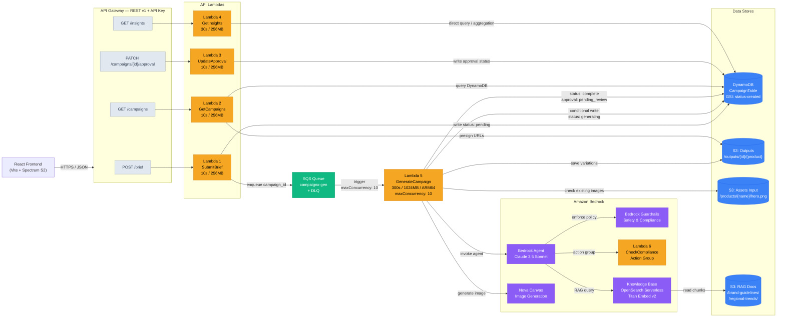

# CampaignX — Lean POC AWS Architecture Diagram

### Updated Architecture Summary (Lean POC)

The architecture has been streamlined to focus exclusively on the **Creative Automation Pipeline** while maintaining high quality via Bedrock AI.

| Component | Status | Decision |
|:----------|:-------|:---------|
| **Kinesis / Glue / Athena** | 🔴 Removed | Overkill. Insights now queried directly from DynamoDB. |
| **SNS (Email)** | 🔴 Removed | POC relies on Dashboard UI polling/refreshes. |
| **EventBridge Scheduler** | 🔴 Removed | KB sync triggered manually via Console/CLI for POC. |
| **Analytics Bucket** | 🔴 Removed | Data footprint reduced to pure campaign assets. |
| **Bedrock Agent / KB** | 🟢 Kept | Core to the Generative AI demonstration. |
| **CheckCompliance** | 🟢 Kept | Demonstrates integration of "Nice to have" brand safety requirements. |

### Updated API Route Map

| Route | Handler | Action |
|:------|:--------|:-------|
| `POST /brief` | Lambda 1 | Validates brief → Creates DynamoDB item → Enqueues SQS message. |
| `GET /campaigns` | Lambda 2 | Fetches campaign lists and details from DynamoDB. |
| `PATCH /campaigns/{id}/approval` | Lambda 3 | Updates the processing status in DynamoDB (Approve/Reject). |
| `GET /insights` | Lambda 4 | Aggregates campaign metrics directly from the DynamoDB table. |
| `SQS Trigger` | Lambda 5 | Main worker: Bedrock Agent orchestration + Image generation. |
