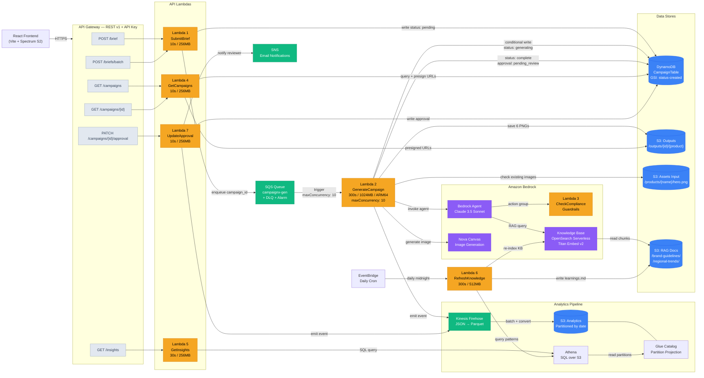

# CampaignX — AWS Architecture Diagram

### Component Legend

| Color | Meaning | Components |
|:------|:--------|:-----------|
| 🟠 Orange | Lambda Functions | L1–L7 (all 7 functions) |
| 🔵 Blue | Storage (S3 / DynamoDB) | 4 S3 buckets + CampaignTable |
| 🟣 Purple | Bedrock AI Services | Agent, Knowledge Base, Nova Canvas |
| 🟢 Green | Queues / Streaming | SQS, Kinesis Firehose, SNS |
| ⬜ Gray | API Routes | All 6 REST endpoints |

### API Route Map

| Route | Lambda | Action |
|:------|:-------|:-------|
| `POST /brief` | Lambda 1 | Validate brief → DynamoDB + SQS |
| `POST /briefs/batch` | Lambda 1 | Validate up to 50 briefs → DynamoDB + SQS |
| `GET /campaigns` | Lambda 4 | List campaigns from DynamoDB |
| `GET /campaigns/{id}` | Lambda 4 | Get campaign detail + presigned image URLs |
| `PATCH /campaigns/{id}/approval` | Lambda 7 | Set approved/rejected → DynamoDB + SNS + Firehose |
| `GET /insights` | Lambda 5 | Athena query (cached 1hr in DynamoDB) |
