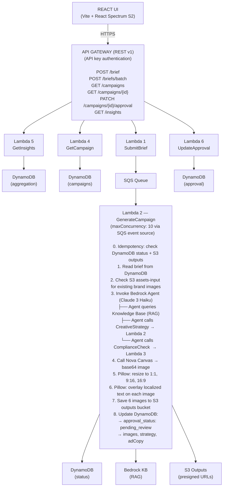

## System Design & Implementation Guide — v3

> **Changelog from v2:** This revision reflects the system as of March 2026. Key changes: Implementation of S3 CORS for direct browser downloads, browser caching bypass for asset fidelity, standardized Spectrum Workflow icons across all views, enhanced drag-and-drop brief ingestion for JSON/YAML, refined Bedrock Knowledge Base synchronization automation, automated bootstrap data upload via Terraform, and Home page template-driven prompt builder with `react-type-animation`. Fixed image download width issues and cross-origin fetch failures. Foundation model updated to Claude 3 Haiku for POC cost efficiency.

---

## Table of Contents

1. [Problem Statement](#1-problem-statement)
2. [Requirements](#2-requirements)
3. [Back-of-the-Envelope Estimation](#3-back-of-the-envelope-estimation)
4. [High-Level Design](#4-high-level-design)
5. [Deep Dive — Data Flow](#5-deep-dive--data-flow)
6. [Deep Dive — Component Design](#6-deep-dive--component-design)
7. [Deep Dive — Database Design](#7-deep-dive--database-design)
8. [Deep Dive — Vector Database (OpenSearch)](#8-deep-dive--vector-database-opensearch)
9. [Deep Dive — API Design](#9-deep-dive--api-design)
10. [Deep Dive — Frontend Architecture](#10-deep-dive--frontend-architecture)
11. [Deep Dive — AI Pipeline](#11-deep-dive--ai-pipeline)
12. [Deep Dive — Analytics & Feedback Loop](#12-deep-dive--analytics--feedback-loop)
13. [Deep Dive — Approval Workflow](#13-deep-dive--approval-workflow)
14. [Infrastructure as Code](#14-infrastructure-as-code)
15. [How to Recreate From Scratch](#15-how-to-recreate-from-scratch)
16. [Key Design Decisions & Trade-offs](#16-key-design-decisions--trade-offs)
17. [Known Limitations](#17-known-limitations)
18. [Future Improvements](#18-future-improvements)

---

## 1. Problem Statement

A global consumer goods company launches hundreds of localized social ad campaigns every month across dozens of markets.

Today this is done manually:
- A creative team writes briefs
- Agencies produce assets per region
- Legal and brand teams review
- Stakeholders in each market approve
- Assets get scheduled and published

This process is slow (weeks per campaign), expensive (agencies + revisions), inconsistent (off-brand creative slips through), and impossible to learn from (siloed performance data).

**The business goal:** design a system that takes a campaign brief as input and produces brand-compliant, legally-vetted, localized creative assets for three social platforms — fully automated.

---

## 2. Requirements

### Functional Requirements

| ID | Requirement |
|----|-------------|
| FR1 | Accept a campaign brief (JSON or YAML) with product name(s), target region, audience, core message, and preferred language |
| FR2 | Generate hero images for each product in three aspect ratios: 1:1 (Instagram), 9:16 (TikTok/Reels), 16:9 (YouTube) |
| FR3 | Overlay localized text on each generated image *(Planned for v3.1)* |
| FR4 | Save all assets in an organized folder structure: `/outputs/{campaign_id}/{product_name}/{ratio}.png` |
| FR5 | Enforce brand compliance on all generated creative |
| FR6 | Enforce legal compliance — no prohibited claims or terms |
| FR7 | Support an approval workflow — campaigns must be reviewed and approved before being considered final |
| FR8 | Provide analytics: cost, compliance rates, top markets, generation performance |
| FR9 | Support batch submission — submit many briefs at once (max 50 per request) *(Planned for v3.1)* |
| FR10 | Support Brief Import — Accept JSON or YAML files via drag-and-drop to auto-fill briefs |
| FR11 | Programmatic Download — Direct browser download of assets via S3 CORS and Blob fetching |
| FR12 | The system must learn over time — past campaign patterns should inform future creative decisions *(Planned for v4.0)* |

### Non-Functional Requirements

| ID | Requirement |
|----|-------------|
| NFR1 | Hundreds of campaigns per month — scale horizontally without infrastructure changes |
| NFR2 | Generation of one campaign (2 products × 3 ratios = 6 images) must complete within 10 minutes |
| NFR3 | Brand and legal guardrails must apply to 100% of outputs with no exceptions |
| NFR4 | Reproducible across environments (dev, staging, prod) via Infrastructure as Code |
| NFR5 | All generated assets must be durable — S3 with versioning enabled |
| NFR6 | Generation must be idempotent — SQS retries must not duplicate work or double-charge Bedrock |

### Out of Scope

- Ad platform integration (Meta, TikTok, Google) — publish step is manual or a future phase
- A/B testing of creatives
- Real-time performance data ingestion (CTR, conversions) — the analytics pipeline is architected to accept this in a future phase

---

## 3. Back-of-the-Envelope Estimation

### Volume Estimates
* **Campaigns per month:** ~500
* **Products per campaign:** 2 (minimum)
* **Images per product:** 3 aspect ratios
* **Total images per month:** 500 × 2 × 3 = 3,000 images

### Compute & Throughput
* **Nova Canvas image generation:** ~10–20s per image
* **Total generation time (serial):** 3,000 × 15s = 45,000s = 12.5 hrs
* **Total generation time (parallel):** ~15 minutes at 50 concurrent
> **Limitation:** Parallelism via SQS + Lambda concurrency is NOT optional. It is required to meet NFR2 at scale. SQS `maxConcurrency` is explicitly capped at 10 to avoid Bedrock throttling, as Bedrock Haiku quota is typically 50–200 concurrent invocations.

### Storage
* **Average image size (PNG):** ~2 MB
* **Monthly storage:** 3,000 × 2 MB = ~6 GB
* **Annual storage:** ~72 GB
* **S3 cost (us-east-1):** ~$1.65 / month

### DynamoDB
* **Writes per campaign:** ~10 (status updates)
* **Monthly writes:** ~5,000
> **Conclusion:** Well within on-demand pricing. No capacity planning needed.

### AI Inference Cost
* **Claude 3 Haiku:** ~2,000 input + 500 output tokens (At $0.25/M input, $1.25/M output → ~$0.001)
* **Nova Canvas:** ~$0.08 per image × 6 images → ~$0.48
* **Total per campaign:** ~$0.48
* **Monthly (500 campaigns):** ~$242

---

## 4. High-Level Design



> **Lambda 3** (CheckCompliance) is internal only — called exclusively by the Bedrock Agent action group, never by API Gateway directly.
>
> **REST API v1** is used (not HTTP v2) because it supports native API key authentication without requiring a separate Lambda authorizer.

---

## 5. Deep Dive — Data Flow

### Flow 1: Generation (user-initiated)

1. **User submits brief**
   - Frontend calls `POST /brief`
   - **Lambda 1:** Validates schema, writes DynamoDB (status: `pending`), pushes to SQS.
   - Returns `202 Accepted` + `{ campaign_id }`
2. **Frontend Loading State**
   - UI navigates to loading screen, polling `GET /campaigns/{id}` every 3s.
3. **SQS triggers Lambda 2** *(maxConcurrency: 10 via event source mapping)*
   - **Idempotency check:** Reads DynamoDB status.
     - IF status != `pending` → skip (already processing/done)
     - Conditional write: set status = `generating` (where status = `pending`)
     - IF condition fails → exit (another instance picked it up)
   - **Check S3 assets-input:**
     - IF image exists → reuse it (skips Nova Canvas, saves ~$0.48)
     - IF missing → continue
   - **Invoke Bedrock Agent:**
     - Agent queries OpenSearch Serverless for brand guidelines via Knowledge Base.
     - Agent calls `CreativeStrategy` action group (**Lambda 2**) → Returns `image_prompt` + localized `ad_copy`.
     - Agent calls `ComplianceCheck` action group (**Lambda 3**) → Returns mocked "Compliance check PASSED" response.
   - **Generate Image:** Call Nova Canvas with `image_prompt` → base64 PNG.
   - **Process Image:** Pillow resizes to 3 aspect ratios and composites localized text overlay on each.
   - **Upload:** Save to S3 (checks if image already exists before uploading):
     - `s3://campaignx-outputs/generated/{id}/{product}/1x1.png`
     - `s3://campaignx-outputs/generated/{id}/{product}/9x16.png`
     - `s3://campaignx-outputs/generated/{id}/{product}/16x9.png`
   - **Update DynamoDB:**
     - `approval_status:` `pending_review`
     - `images:` `{ "1x1": {...}, "9x16": {...}, ... }`
     - `strategy:` "Bedrock Agent output..."
     - `adCopy:` `[{ "lang": "en", "text": "..." }]`
     - `image_prompt:` "..."
     - `created_at:` ISO8601 timestamp
4. **Frontend UI Update**
   - Poll returns `status: "complete"` + `approval_status: "pending_review"` → Canvas renders.
   - Poll returns `status: "failed"` → error screen with `failure_reason`.
   - Poll exceeds 10 minutes → timeout error with retry option.

### Flow 2: Approval (reviewer-initiated)

1. Reviewer opens Canvas → sees Approval block (`approval_status: pending_review`).
2. Clicks **Approve** or **Reject** (with optional notes).
3. Frontend triggers `PATCH /campaigns/{id}/approval`.
4. **Lambda 6** writes `approval_status`, `reviewed_by`, and `reviewed_at` to DynamoDB.
5. Frontend reflects updated status.

---

## 6. Deep Dive — Component Design

### Lambda Functions (6 total)

| # | Name | Trigger | Timeout | Memory | Architecture | Purpose |
|---|------|---------|---------|--------|-------------|---------|
| 1 | SubmitBrief | POST /brief, POST /briefs/batch | 10s | 256 MB | x86_64 | Validate brief, write DynamoDB, push to SQS |
| 2 | GenerateCampaign | SQS (maxConcurrency: 10) & Action Group | 300s | 1024 MB | arm64 | Full generation pipeline & handles `CreativeStrategy` |
| 3 | CheckCompliance | Bedrock Agent action group (internal) | 30s | 256 MB | x86_64 | Returns a mocked PASS compliance report for the Agent |
| 4 | GetCampaigns | GET /campaigns, GET /campaigns/{id} | 10s | 256 MB | x86_64 | Query DynamoDB, generate S3 presigned URLs |
| 5 | GetInsights | GET /insights | 30s | 256 MB | x86_64 | Mock / stub endpoint for future analytics |
| 6 | UpdateApproval | PATCH /campaigns/{id}/approval | 10s | 256 MB | x86_64 | Write approval status to DynamoDB |

> Lambda 2 uses **arm64 (Graviton2)** for 20% cost savings and better performance on image processing workloads. All other Lambdas use x86_64 (default).
>
> Lambdas 3 and 5 are currently deployed as stubs/mocks for the POC. Lambda 3 is wired as an action group but returns a hardcoded pass. Lambda 5 currently returns a hello world.
>
> Lambda 2's **SQS event source mapping** uses `maxConcurrency: 10` to prevent overwhelming Bedrock's per-model throttling limits. This means at most 10 campaigns generate simultaneously. At ~5 minutes per campaign, this processes ~120 campaigns/hour — sufficient for 500/month.

### SQS Queue

```
Queue:            campaignx-{env}-campaign-gen
Type:             Standard (ordering not required)
Visibility:       360s (60s buffer above Lambda timeout of 300s)
Retention:        1 day
DLQ:              campaignx-{env}-campaign-gen-dlq
Max receive count: 3 retries before moving to DLQ
```

**Why SQS:** Without a queue, Lambda 1 would invoke Lambda 2 synchronously and block for 5 minutes per campaign. SQS decouples submission from generation. Lambda scales to match queue depth automatically — but capped at `maxConcurrency: 10` to respect Bedrock throttling limits.

### S3 Buckets (3 total)

| Bucket | Contents | Read by | Write by |
|--------|----------|---------|----------|
| `campaignx-{env}-rag-docs` | `/brand-guidelines/`, `/regional-trends/` | Bedrock KB | Terraform bootstrap (auto-uploaded on apply) |
| `campaignx-{env}-assets-input` | `/products/{name}/hero.png` | Lambda 2 | Creative team (manual upload) or Terraform bootstrap |
| `campaignx-{env}-outputs` | `/outputs/{id}/{product}/{ratio}.png` | Lambda 4, Frontend | Lambda 2 |

All buckets: versioning ON, SSE-AES256, public access blocked. Outputs bucket has GET CORS enabled for in-browser image display.

> Frontend hosting is **not** managed by this Terraform. Deploy to Vercel/Netlify or manage a separate S3+CloudFront stack.

---

## 7. Deep Dive — Database Design

### DynamoDB — CampaignTable

**Primary Key:** `campaign_id` (PK, String) + `product_name` (SK, String)

> Rationale for composite key: a single campaign covers multiple products. `campaign_id` as PK allows querying all products in one campaign. `product_name` as SK allows targeting a specific product. Both patterns are needed and neither requires a scan.

**Attributes:**

| Attribute | Type | Values / Notes |
|-----------|------|----------------|
| `campaign_id` | String | UUID — partition key |
| `product_name` | String | e.g. "Dove Shampoo" — sort key |
| `region` | String | e.g. "brazil" |
| `audience` | String | e.g. "women 25-40" |
| `message` | String | e.g. "Feel confident" |
| `strategy` | String | Bedrock Agent generated strategy completion |
| `images` | Map | `{ "1x1": {"url": "...", "format": "...", ...}, ... }` |
| `adCopy` | List | `[{'lang': 'en', 'text': '...'}]` |
| `image_prompt` | String | Prompt used or synthesized for Nova Canvas |
| `approval_status` | String | `pending_review` \| `approved` \| `rejected` |
| `reviewed_by` | String | reviewer email |
| `reviewer_notes` | String | optional free text |
| `reviewed_at` | String | ISO 8601 timestamp |
| `created_at` | String | ISO 8601 timestamp |
| `ttl` | Number | Unix timestamp — auto-expire records after 90 days |

> **`approval_status` lifecycle:** Written to DynamoDB by `GenerateCampaign` as `pending_review` when generation completes. The Status/Failed flags were removed in v3 to simplify the POC table schema.

**Global Secondary Index:**

```
Name:       status-created-index
Hash key:   approval_status
Sort key:   created_at
Purpose:    Query all campaigns WHERE approval_status = "pending_review"
            ORDER BY created_at DESC LIMIT 20
            Powers a reviewer dashboard without a full table scan.
            Sort key enables pagination and chronological ordering.
```

> GSI is sparse — items without `approval_status` are excluded automatically. This means only completed campaigns appear in the index, which is the desired behavior.

**Billing:** `PAY_PER_REQUEST` — zero cost when idle, no capacity planning at POC scale.

### Analytics

### Analytics

In the current v3 POC, analytics are stubbed. In a future production iteration, Lambda 5 (GetInsights) will perform `Scan` operations with server-side aggregation to compute campaign metrics (total count, regional breakdown, average cost, compliance rates) directly from DynamoDB without needing a Firehose data pipeline.

---

## 8. Deep Dive — Vector Database (OpenSearch)

The system utilizes **Amazon OpenSearch Serverless (OSS)** as the vector database for high-performance semantic retrieval. This is a crucial component that allows the Bedrock Agent to access brand guidelines and market trends contextually.

### Configuration

-   **Collection Type:** `VECTORSEARCH`
-   **Engine:** `nmslib` (compatible with `knn_vector`)
-   **Index Type:** `knn_vector`
-   **Distance Metric:** `l2` (Euclidean distance) or `cosine`
-   **Dimensions:** `1024` (Must be strictly aligned with `amazon.titan-embed-text-v2:0`)

### Access Control

OpenSearch Serverless is secured via:
1.  **Network Policy:** Restricts access to specific VPC endpoints or public access if required by the Bedrock service.
2.  **Access Policy (IAM):** Grants the Bedrock Knowledge Base service role permissions to query (`indices:data/read/search`) and write (`indices:data/write/index`) to the collection.

### Ingestion Pipeline
When documents land in the `rag-docs` S3 bucket, a sync job (triggered automatically on `terraform apply` or manually via AWS CLI) causes Bedrock to:
1.  Partition the documents into chunks.
2.  Pass chunks through the Titan Embed model to generate vector representations.
3.  Store vectors and original text snippets in the OpenSearch index.

---

## 9. Deep Dive — API Design

All endpoints use **REST API v1** (API Gateway). CORS enabled via OPTIONS methods on all resources. API key authentication enabled — no Cognito at POC stage.

> **Why REST v1 over HTTP v2:** REST API v1 supports native API key usage plans without a Lambda authorizer. HTTP v2 (`.../apigatewayv2/...`) does not support API keys natively. The trade-off is higher cost ($3.50/M vs $1.00/M requests) and more verbose CORS setup, but at POC scale (~100K requests/month) the cost difference is ~$0.25/month.

> **REST v1 Lambda integration note:** REST v1 sends a different event format than HTTP v2. Lambda handlers must use `event["body"]` (string, must be JSON-parsed), `event["pathParameters"]`, and `event["queryStringParameters"]`. Response format must include `statusCode`, `headers`, and `body` (string).

### POST /brief

Accepts a single creative brief payload and writes it to DynamoDB in a `pending` state.
It also queues a message in SQS to asynchronously trigger the Lambda generation pipeline.

```json
// Request
{
  "product_name": "Dove Shampoo",
  "region": "brazil",
  "audience": "women 25-40",
  "message": "Feel confident every day",
  "language": "pt-BR"
}

// Response 202
{
  "campaign_id": "a3f2b1c9-...",
  "product_name": "Dove Shampoo",
  "status": "pending"
}
```

### POST /briefs/batch

Accepts an array of up to 50 brief payloads for bulk campaign generation.
It batches DynamoDB writes and SQS messages to optimize throughput and stay within Lambda timeouts.

```json
// Request (max 50 briefs per request)
{
  "briefs": [
    { "product_name": "...", "region": "...", "audience": "...", "message": "...", "language": "..." },
    { "product_name": "...", "region": "...", "audience": "...", "message": "...", "language": "..." }
  ]
}

// Response 202
{
  "batch_id": "b9c3...",
  "campaign_ids": ["a3f2...", "c9d4..."],
  "count": 2
}

// Response 400 (if > 50 briefs)
{
  "error": "Batch size exceeds maximum of 50 briefs per request"
}
```

> **Batch limits:** Max 50 briefs per request. Lambda 1 writes to DynamoDB in batches of 25 (`BatchWriteItem` limit) and to SQS in batches of 10 (`SendMessageBatch` limit). At 50 briefs: 2 DynamoDB batches + 5 SQS batches, well within the 10s Lambda timeout.

### GET /campaigns/{id}

Returns the current status, asset presigned URLs, and generated ad copy for a specific campaign.
The frontend UI polls this endpoint every 3 seconds to update the generation pipeline and Canvas views.

```json
// Response 200 (in progress)
{ "campaign_id": "...", "status": "generating" }

// Response 200 (complete, awaiting review)
{
  "campaign_id": "...",
  "status": "complete",
  "approval_status": "pending_review",
  "output_paths": {
    "1x1":  "https://presigned-s3-url...",
    "9x16": "https://presigned-s3-url...",
    "16x9": "https://presigned-s3-url..."
  },
  "compliance": {
    "pass": ["no prohibited words", "brand colors present"],
    "warn": ["headline slightly long"],
    "fail": []
  },
  "cost_usd": 0.51,
  "ad_copy": {
    "headline": "Sinta-se confiante todo dia",
    "body": "Dove Shampoo cuida dos seus cabelos...",
    "cta": "Compre agora"
  }
}

// Response 200 (failed)
{
  "campaign_id": "...",
  "status": "failed",
  "failure_reason": "Compliance hard fail after 3 revision attempts"
}
```

### PATCH /campaigns/{id}/approval

Updates the approval status of a generated campaign in DynamoDB to either `approved` or `rejected`.
It allows human reviewers to attach contextual notes regarding their compliance decision.

```json
// Request
{
  "approval_status": "approved",
  "reviewer_notes": "Great work for the Brazil market",
  "reviewed_by": "jane@company.com"
}

// Response 200
{ "campaign_id": "...", "approval_status": "approved" }
```

### GET /insights

Provides aggregated system analytics, such as total campaigns, generation costs, and compliance pass rates.
Currently returns stubbed data while the long-term server-side DynamoDB aggregation pipeline is planned.

```json
// Response 200
{
  "total_campaigns": 847,
  "top_regions": [
    { "region": "brazil", "count": 82 },
    { "region": "usa",    "count": 61 }
  ],
  "avg_cost_usd": 0.49,
  "total_cost_usd": 415.03,
  "compliance_pass_rate": 0.94,
  "avg_generation_time_ms": 42300,
  "most_flagged_terms": ["guaranteed", "proven"],
  "kb_last_refreshed": "2025-04-01T00:00:00Z"
}
```

> **Insights source:** Lambda 5 aggregates metrics directly from DynamoDB scans. At POC scale this is performant and avoids the need for a dedicated analytics pipeline.

---

## 10. Deep Dive — Frontend Architecture

### Tech Stack

| Layer | Technology |
|-------|-----------:|
| Framework | React 18 + Vite + TypeScript |
| Package manager | Bun |
| UI library | Adobe React Spectrum S2 (`@react-spectrum/s2`) |
| Macro plugin | `unplugin-parcel-macros` — **must come first** in `vite.config.ts` |
| Styling | React Spectrum S2 style macro + scoped CSS files |

### Screen Flow

```
Home → BriefForm → LoadingPipeline → Canvas → [Insights]
                                   ↘ ErrorScreen (on failure/timeout)
```

| Screen | Purpose |
|--------|---------|
| Home | Recent campaigns list, prompt bar to start a new one |
| BriefForm | Manual form OR JSON/YAML file upload; batch mode uploads CSV or JSON array (max 50) |
| LoadingPipeline | Animated pipeline steps while polling `GET /campaigns/{id}` every 3s |
| Canvas | Sophia-style blueprint with 9 blocks (see below) |
| Insights | Analytics dashboard powered by `GET /insights` |
| ErrorScreen | Displayed when status = "failed" or polling exceeds 10 minutes |

### Canvas Blocks (Sophia-style Blueprint)

| Block | Name | Content |
|-------|------|---------|
| A | Creative Strategy | Agent's reasoning — why this creative for this market |
| B | Image 1:1 | Generated Instagram image + download button |
| C | Image 9:16 | Generated TikTok/Reels image + download button |
| D | Image 16:9 | Generated YouTube image + download button |
| E | Ad Copy | Localized headline, body text, CTA |
| F | Compliance Report | Pass / Warn / Fail items, colour-coded green / amber / red |
| G | Suggested Next Steps | Agent recommendations for this market |
| H | Output Files | Folder tree of saved asset paths, cost and token report |
| I | Approval Status | Status badge, Approve/Reject buttons, reviewer notes field |

### AI Cursor

Every block has a floating popover (AI Cursor pattern). The user types a refinement ("make it more vibrant", "translate to Spanish"). Only that block regenerates via a targeted API call — the rest of the canvas stays intact. This is the key UX differentiator of the Sophia-style canvas.

### Icon System

The application uses **Adobe Spectrum Workflow Icons** (`@spectrum-icons/workflow`) throughout the UI. To ensure consistent sizing across different screen contexts, a global CSS override targets the `.spectrum-Icon` class, mapping Spectrum size props (XS, S, M, L) to fixed pixel values (14px, 18px, 24px, 36px).

### Polling Pattern

Frontend polls `GET /campaigns/{id}` every 3 seconds.

```
pending → generating → complete (approval_status: pending_review) → approved | rejected
                     → failed (show ErrorScreen with failure_reason)

Timeout: if polling exceeds 10 minutes without status change from "generating",
         show timeout error with retry option.
```

On `status: "complete"` the canvas renders with real images. On `status: "failed"` the ErrorScreen renders with the `failure_reason` from DynamoDB. No WebSockets required — polling every 3s costs ~100 API calls per campaign (negligible), and the UX difference vs push notification is imperceptible for a 1–5 minute generation job.

### File Structure

```
src/
├── App.tsx                   router + Provider wrapper
├── main.tsx                  entry point — <Provider colorScheme="dark">
├── types/index.ts            all TypeScript types
├── data/mockData.ts          mock campaign for local development
├── hooks/useCampaign.ts      all state + API call logic
├── api.ts                    fetch wrappers for all 6 endpoints
├── pages/
│   ├── Home.tsx + .css
│   ├── BriefForm.tsx + .css
│   ├── LoadingPipeline.tsx + .css
│   ├── Canvas.tsx + .css
│   ├── ErrorScreen.tsx + .css
│   └── Insights.tsx + .css
└── components/
    ├── layout/TopNav.tsx + .css
    └── shared/
        ├── AICursor.tsx + .css
        └── ImageDetail.tsx + .css
```

### Important Setup Notes

1. **Macro plugin order** in `vite.config.ts`:
   ```ts
   plugins: [macros.vite(), react()]  // macros MUST come first
   ```

2. **React Spectrum S2 breaking change:** no `Flex` or `Grid` components — use `<div>` with style macro instead.

3. **Wrap entire app in Provider:**
   ```tsx
   <Provider colorScheme="dark">
     <App />
   </Provider>
   ```

4. **To connect to real API:** edit `src/hooks/useCampaign.ts` only. Replace `mockGenerateCampaign()` with real API calls via `src/api.ts`. All UI components remain unchanged.

5. **REST v1 API key:** include `x-api-key` header in all fetch calls in `src/api.ts`.

---

## 11. Deep Dive — AI Pipeline

### Models Used

| Role | Model | Model ID |
|------|-------|----------|
| Campaign Orchestrator (LLM) | Claude 3 Haiku | `anthropic.claude-3-haiku-20240307-v1:0` |
| Image Generation | Amazon Nova Canvas | `amazon.nova-canvas-v1:0` |
| Embeddings / RAG | Amazon Titan Embed Text v2 | `amazon.titan-embed-text-v2:0` — 1024 dimensions |

> **Why Titan Embed v2 over Nova Embed v1:** Titan Embed v2 is more mature, has configurable dimensions (256/512/1024 — useful for cost optimization later), and is widely documented. The OpenSearch index MUST be configured with the same dimension count (1024).

### Bedrock Agent

**Name:** `campaignx-{env}-campaign-orchestrator`
**Instruction file:** `modules/bedrock/src/agent.txt`

The agent has two action groups and one knowledge base association. Execution flow per brief:

```
Agent receives: { product_name, region, message, audience }
  ↓
Automatic RAG query to Knowledge Base
  → OpenSearch vector search over brand-guidelines/ + regional-trends/
  → Top-k chunks prepended to agent context window
  ↓
Calls CreativeStrategy action group → Lambda 2
  → Returns: image_prompt + localized ad_copy
  ↓
Calls ComplianceCheck action group → Lambda 3
  → Returns: Mocked PASS response (POC only)
  ↓
Returns structured creative strategy to Lambda 2
```

The agent instruction (`agent.txt`) is the system prompt. It defines the exact workflow sequence, output format, tone rules, compliance hard stops, and image prompt guidelines. It is version-controlled in the repository.

### Knowledge Base (RAG)

```
Vector store:  OpenSearch Serverless (VECTORSEARCH collection)
Index:         knn_vector, dimension 1024, engine faiss, space_type l2
Embedding:     amazon.titan-embed-text-v2:0 (must match index dimension)
```

**Two data sources on the same Knowledge Base:**

| Data Source | S3 Prefix | Contents |
|-------------|-----------|---------|
| Brand Guidelines | `brand-guidelines/` | `brand_guidelines.md`, `marketing_voice.md` |
| Regional Trends | `regional-trends/` | `brazil.md`, `japan.md`, `usa.md` |

One KB means one vector search retrieves relevant chunks from both sources simultaneously. Bedrock ranks all chunks by relevance — no manual result merging needed.

### Guardrails (Planned Implementation)

> **Note:** Guardrail infrastructure is deployed via Terraform (e.g. `blocks words`, `denies topics`), but the action group logic in Lambda 3 is currently returning a hardcoded `PASS` for the v3 POC.

Once the full Python validator is implemented in Lambda 3:
If a guardrail blocks output: Lambda 3 will return a `FAIL` compliance item. The Bedrock Agent is instructed to interpret this failure, revise the copy, and retry. After 3 failures, the campaign status would be marked as failed.

### Image Generation (Nova Canvas)

In v3, Pillow-based resizing and text rendering are no longer used. Instead, Lambda 2 generates images uniquely for each required aspect ratio by explicitly passing the `width` and `height` coordinates to the `amazon.nova-canvas-v1:0` model. 

1. Lambda loops through predefined aspect ratio targets:
   - `1x1` (1024 × 1024)
   - `9x16` (768 × 1280)
   - `16x9` (1280 × 768)
2. For each, an API request triggers **Nova Canvas** in `TEXT_IMAGE` mode.
3. The resulting `base64` image is decoded synchronously.
4. The decoded binary PNG is uploaded straight to the S3 `outputs` bucket.
5. If the Nova Canvas request fails, the system executes a graceful fallback by substituting the original product reference photo from the `assets-input` bucket.

---

## 12. Deep Dive — Analytics & Cost Tracking (Planned Implementation)

> **Note:** The following design describes the planned production architecture. In the current v3 POC, cost tracking logic has been removed from Lambda 2 to simplify deployment, and Lambda 5 (GetInsights) acts as a mock endpoint.

### Architecture

Once implemented, the frontend `Insights` page will power a full management dashboard for reviewing:
- Total generated campaigns vs queue depth
- Average and total cost
- Pipeline success and compliance pass rate
- Geographical heatmaps of campaigns (based on `region` tag)

### Cost Tracking

Lambda 2 will calculate `estimated_cost_usd` per campaign:

```python
nova_canvas_cost = nova_canvas_calls * 0.08
llm_cost = (input_tokens / 1_000_000 * 0.25) + (output_tokens / 1_000_000 * 1.25)
total_cost = nova_canvas_cost + llm_cost
```

This will be stored in DynamoDB per campaign item and surfaced in `GET /insights` — directly addressing the business goal of measuring ROI per region and market.

### Knowledge Base Sync

RAG documents and product images are automatically uploaded to S3 via Terraform `aws_s3_object` resources. After upload, a `terraform_data` provisioner triggers `StartIngestionJob` to re-index the Knowledge Base. Manual sync is also available via the AWS CLI.

---

## 13. Deep Dive — Approval Workflow

### State Machine

In the current v3 POC, the campaign generation and approval workflow is tracked via the `approval_status` field on the DynamoDB `CampaignTable` record:

```
approval_status (lifecycle of a campaign):
  (not set)      → campaign initially submitted, awaiting SQS Lambda 2 processing
  pending_review → generation completed successfully by Lambda 2, awaits human oversight
  approved       → reviewer clicked Approve via UI (Lambda 6)
  rejected       → reviewer clicked Reject via UI (Lambda 6)
```

> **Note:** In earlier iterations of this architecture, a separate granular `status` field was used to track intermediate states (`pending`, `generating`, `failed`). This was removed in v3 to simplify the POC DynamoDB schema.

### Notification

Approval state changes are reflected in real-time on the Canvas UI. The frontend fetches `GET /campaigns/{id}` and renders the updated `approval_status` badge.

### GSI Usage

The `status-created-index` GSI on DynamoDB enables:
```
Query all campaigns WHERE approval_status = "pending_review"
      ORDER BY created_at DESC
      LIMIT 20
```
This powers a reviewer dashboard without requiring a full table scan. The sort key (`created_at`) enables chronological ordering and pagination. Without the GSI, finding all pending reviews would be O(n) over the entire table.

The GSI is **sparse** — items without `approval_status` (i.e., campaigns still generating or failed) are automatically excluded from the index. This is the desired behavior.

---

## 14. Key Design Decisions & Trade-offs

### Decision 1: SQS vs Direct Lambda Invocation

| | Choice |
|---|---|
| **Chose** | SQS queue between Lambda 1 and Lambda 2 |
| **Alternative** | Lambda 1 invokes Lambda 2 asynchronously |
| **Reason** | SQS provides built-in retry (3× before DLQ), visibility timeout prevents duplicate processing, and `maxConcurrency` on the event source mapping caps parallel invocations at 10 to prevent Bedrock throttling. Direct async invocation requires managing failure states manually and offers no built-in backpressure. |

### Decision 2: One Bedrock Agent vs Multiple Agents

| | Choice |
|---|---|
| **Chose** | One agent with 2 action groups |
| **Alternative** | Separate Creative agent + Compliance agent |
| **Reason** | Multi-agent coordination adds latency and Terraform complexity with no benefit at POC scale. One agent handles creative strategy and compliance sequentially. The `agent.txt` instruction file defines the exact workflow. Upgrade to multi-agent only if the context window becomes a bottleneck. |

### Decision 3: DynamoDB vs RDS

| | Choice |
|---|---|
| **Chose** | DynamoDB (pay-per-request) |
| **Alternative** | Aurora Serverless PostgreSQL |
| **Reason** | Campaign data is accessed by primary key 99% of the time. DynamoDB delivers microsecond reads for this pattern with no joins required. Pay-per-request means zero cost at idle. Aurora's minimum cost is ~$50/month even at zero load. |

### Decision 4: Polling vs WebSockets

| | Choice |
|---|---|
| **Chose** | Frontend polling every 3s |
| **Alternative** | API Gateway WebSocket + Lambda push |
| **Reason** | Generation takes 1–5 minutes. Polling at 3s costs ~100 API calls per campaign — negligible. WebSockets require connection management, reconnection logic, a connection table in DynamoDB, and significantly more infrastructure. The UX difference is imperceptible to users. |

### Decision 5: DynamoDB Analytics vs Dedicated Pipeline

| | Choice |
|---|---|
| **Chose** | Direct DynamoDB aggregation via Lambda 5 |
| **Alternative** | Kinesis Firehose → S3 Parquet → Glue → Athena |
| **Reason** | At POC scale (~500 campaigns/month), DynamoDB scans with server-side aggregation are fast and require zero additional infrastructure. A dedicated analytics pipeline (Firehose + Glue + Athena) adds 4+ services, IAM complexity, and cost with no measurable benefit until campaign volume exceeds ~10,000/month. Can be added as a future enhancement. |

### Decision 6: One Knowledge Base vs Two

| | Choice |
|---|---|
| **Chose** | One KB with one S3 data source (entire `rag-docs` bucket) |
| **Alternative** | Separate KB for brand guidelines vs regional trends |
| **Reason** | One KB means a single vector search retrieves relevant chunks from all sources simultaneously. Bedrock ranks all chunks by relevance regardless of S3 prefix. Multiple KBs would require separate retrieval calls and manual result merging — more complex with no quality benefit. |

### Decision 7: REST API v1 vs HTTP API v2

| | Choice |
|---|---|
| **Chose** | REST API v1 |
| **Alternative** | HTTP API v2 |
| **Reason** | REST API v1 supports native API key authentication via usage plans without requiring a Lambda authorizer. HTTP v2 does not support API keys natively. Trade-off: REST v1 is ~3.5x more expensive per million requests ($3.50 vs $1.00) and requires manual OPTIONS methods for CORS. At POC scale (~100K requests/month), the cost difference is ~$0.25/month — negligible. |

### Decision 8: Titan Embed v2 vs Nova Embed v1

| | Choice |
|---|---|
| **Chose** | Amazon Titan Embed Text v2 (`amazon.titan-embed-text-v2:0`) |
| **Alternative** | Amazon Nova Embed (`amazon.nova-embed-text-v1`) |
| **Reason** | Titan Embed v2 is more mature, has configurable dimension sizes (256/512/1024), and is widely documented. Configurable dimensions allow cost optimization in the future — reduce to 512 or 256 dims if retrieval quality is sufficient, halving OpenSearch storage and query cost. |

---

## 15. Known Limitations

These are accepted constraints for the POC. They do not block implementation but should be understood by anyone building or operating the system.

### 15.1 Bedrock Agent Iteration Control (Planned for v4.0)

The design specifies "up to 3 compliance retry attempts" when the Guardrail rejects ad copy. However, Bedrock Agents do not enforce a strict iteration count by default — the LLM decides when to stop retrying.

**Risk:** Once Lambda 3's guardrail validation is fully implemented, the agent could loop more than 3 times, burning tokens and extending generation time. In extreme cases it could hit the Lambda 2 timeout (300s).

**Mitigation (must implement):**
- Set `maximumIterations` in the Bedrock Agent Terraform config (e.g., `max_iterations = 5` — allows 3 compliance retries + 2 for normal flow)
- Inside Lambda 3 (CheckCompliance): maintain an invocation counter in the event payload. If `invocation_count >= 3`, return a hard `FAIL` with `"max retries exceeded"` regardless of Guardrail output. This forces the agent to stop.
- Lambda 2 should check if the agent's response contains a hard fail and set `status: "failed"` + `failure_reason` in DynamoDB accordingly.

### 15.2 DynamoDB Scan for Insights (Planned for v4.0)

Once implemented, Lambda 5 (GetInsights) will perform a full `Scan` on the CampaignTable to aggregate metrics. At small scale (~500 campaigns), this completes in under 1 second. As the table grows beyond ~10,000 items, scan performance will degrade.

**Mitigation:** If insights latency becomes an issue, consider adding a dedicated analytics pipeline (Kinesis Firehose → S3 Parquet → Athena) or caching aggregated metrics in a separate DynamoDB item with a TTL.

### 15.3 Sequential Image Generation Timeouts

Lambda 2 is configured with a 300-second (5-minute) timeout. In v3, Lambda 2 generates images for `1x1`, `9x16`, and `16x9` sequentially by running a loop containing three synchronous `invoke_model` requests to `amazon.nova-canvas-v1:0`.

**Risk:** If Nova Canvas latency spikes during high-load periods on AWS (e.g., taking 30–45 seconds per image) and is combined with a slow initial Bedrock Agent execution, the Lambda could hit its 300s execution limit and abnormally terminate.

**Mitigation:** If timeouts occur frequently, increase the Lambda timeout to 600s or refactor the generation loop to dispatch the 3 Nova Canvas calls asynchronously (e.g., using `asyncio` or ThreadPoolExecutor) to process them in parallel.

### 15.4 Presigned URL Expiry

Lambda 4 generates S3 presigned URLs for image display in the frontend. These URLs expire after a configurable duration (currently set to **7 days** / 604,800 seconds in `get_campaigns.py`). If a reviewer leaves the Canvas tab open for longer than the expiry period, images will fail to load.

**Mitigation:** Set presigned URL expiry to 24 hours (sufficient for review workflows). The frontend can detect `403` responses on image loads and re-fetch the campaign to get fresh URLs.

---

## 16. Future Improvements

### Short Term (v3.1)
- **Automatic Logo Overlay:** Allow users to upload a brand logo (PNG/SVG) and have the `GenerateCampaign` Lambda composite it onto the final generated images using Pillow.
- **Improved Batch Management:** Real-time progress bar for multi-campaign batch uploads.
- **Bulk Download:** Zip the entire campaign output folder for a single-click download.

### Long Term (v4.0)
- **Video Generation:** Expand from Nova Canvas to Nova Reel for short social video assets.
- **Ad Platform Integration:** One-click publish to Meta Ad Manager and TikTok Ads.
- **A/B Testing Integration:** Automatic variation generation based on historical CTR data.

These are out of scope for the POC but should be considered for production readiness.

| Priority | Improvement | Rationale |
|----------|-------------|-----------|
| **P1** | **Cognito authentication** | Replace API key auth with JWT-based user auth. Enables per-user permissions, reviewer identity verification, and audit trails. |
| **P1** | **CloudFront for image delivery** | Replace presigned URLs with CloudFront + OAI. Provides edge caching, eliminates URL expiry issues, and reduces S3 costs at scale. |
| **P1** | **Structured logging + X-Ray tracing** | Add AWS X-Ray to all Lambdas for end-to-end request tracing. Critical for debugging generation failures across the multi-service pipeline. |
| **P2** | **Step Functions for orchestration** | Replace Lambda 2's monolithic pipeline with Step Functions. Each step (Bedrock call, Nova Canvas, Pillow, S3 upload) becomes a separate state. Enables partial retries, visual debugging, and cleaner error handling. |
| **P2** | **Multi-product parallelism** | Currently Lambda 2 processes products sequentially within a campaign. For campaigns with 5+ products, process each product in parallel (e.g., SQS message per product, not per campaign). |
| **P2** | **WAF on API Gateway** | Add AWS WAF rules to rate-limit requests, block suspicious IPs, and prevent abuse of the batch endpoint. |
| **P3** | **Ad platform integration** | Publish approved assets directly to Meta Ads, TikTok Ads, and Google Ads via their APIs. Requires OAuth integration per platform. |
| **P3** | **A/B testing of creatives** | Generate 2–3 creative variants per brief, publish all, and ingest platform performance data (CTR, conversions) to determine winners. Feed results back into the RAG pipeline. |
| **P3** | **Aurora Serverless for complex queries** | If analytics needs grow beyond what Athena + DynamoDB can serve (e.g., JOINs, real-time dashboards), migrate to Aurora Serverless v2 with a read replica for analytics. |
| **P3** | **Fine-tuning** | Once sufficient approved campaigns exist (~1,000+), fine-tune the LLM on successful creative patterns. This would complement RAG with learned style preferences. |

---

# Appendix

## Quick Deployment Guide

### 1. Backend (Infrastructure as Code)
The entire AWS environment is managed via Terraform across the following structure:

```
campaignx-infra/
├── env/
│   ├── dev/
│   │   ├── dev.tf          → calls module "infrastructure" {}
│   │   ├── locals.tf       → ALL config lives here as maps
│   │   ├── outputs.tf
│   │   ├── providers.tf
│   │   └── variables.tf
├── infrastructure/
│   ├── main.tf             ← module calls + wiring (the glue)
│   ├── outputs.tf
│   └── variables.tf
└── modules/
    ├── api_gateway/        → REST API v1
    ├── bedrock/            → OpenSearch + KB + Agent
    ├── dynamodb/           → CampaignTable + GSI
    ├── guardrails/         → Content filters
    ├── iam/                → IAM roles
    ├── iam_managed_policy/ → Policy documents
    ├── iam_role_policy_attachment/
    ├── lambda/             → All 6 functions
    ├── sqs/                → Job queue
    └── storage/            → S3 buckets
```

Deployment is automated through the following sequence:

1. **Initialize State:** Create the Terraform backend state bucket using the setup script:
   ```bash
   ./scripts/setup-state-bucket.sh
   ```
2. **Provision:** Initialize and apply the infrastructure.
   ```bash
   terraform -chdir=env/dev init
   terraform -chdir=env/dev validate
   terraform -chdir=env/dev plan
   terraform -chdir=env/dev apply -auto-approve
   ```
3. **Outputs:** Once complete, note the `api_gateway_url` and `api_key_value` from the Terraform output.

### 2. Frontend (React UI)
Configure the application to point to the newly provisioned backend:

1. **Environment:** Update the `.env` file in the `campaignx` directory with the URLs and API keys from the Terraform step.
2. **Launch:** install dependencies and start the local development server.
   ```bash
   bun install
   bun dev
   ```

---

*End of document — v3, revised 2026-03-08*
